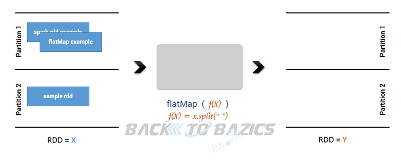

# RDD Advanced Operations

## Introduction

In this lesson, we shall look at some advanced operations that we can perform on RDDs. we will look at some more mapping and grouping functions which add extra functionality to the basic operations that we saw earlier. 

## Objectives

* Differentiate between `map()` and `flatMap(func)` transformations. 
* Identify suitable use-cases for `groupByKey()` and `reduceByKey()`.
* Demonstrate knowledge of advanced transformations including `mapPartitions()` and `mapPartitionsWithIndex()`

## The `flatMap(func)` transformation

Recall the `map(func)` action that used a function to transform RDD contents. `map()` will return more or less than one element. Suppose you want your newly created RDD to consist of the elements generated by the function provided. Using a simple `map()` action would result the new RDD being made up iterators having 0 to many elements. We are often interested in the values contained within those iterators. This is where we can use `flatMap()` transformation, which is similar to `map()` except that each element in the input gets mapped to zero or more output elements. 



In order to demonstrate this behaviour, we shall first generate a a word in singular and plural, and a range that grows in length with each following operation. 

* Create a new base RDD with words 'cat', 'elephant', 'rat', 'rat', 'cat' and parallelize to 4 cores. 


```python
# Initialize a spark context 

# Code here 

```


```python
# Create a new base RDD from list ['cat', 'elephant', 'rat', 'rat', 'cat'] and paralellize to 4 cores

# Code here 

```

We can now create a new RDD by turning these words into plural (adding s to each element) and storing singular and plural values (cat, cats) as a tuple. 

Consult the spark documentation before attempting this step

1. Use a lambda function both with `map()` and `flatmap()` that concatenates an 's' to each word. V
2. View the contents of RDDs using `collect()` action
3. Count the elements of both RDDs with `count()` action. 


```python
# Use map transformation on wordsRDD

# Code here 


# View and count the elements

# Code here 


# [('cat', 'cats'), ('elephant', 'elephants'), ('rat', 'rats'), ('rat', 'rats'), ('cat', 'cats')]
# 5
```

    [('cat', 'cats'), ('elephant', 'elephants'), ('rat', 'rats'), ('rat', 'rats'), ('cat', 'cats')]
    5


```python
# Use flatMap transformation on wordsRDD

# Code here 


# View and count the elements

# Code here 


# ['cat', 'cats', 'elephant', 'elephants', 'rat', 'rats', 'rat', 'rats', 'cat', 'cats']
# 10
```

    ['cat', 'cats', 'elephant', 'elephants', 'rat', 'rats', 'rat', 'rats', 'cat', 'cats']
    10


So in essence, we can see that `map()` transforms an RDD of size N to a new RDD of size N. `flatMap()`, however, can transform an RDD into another one having different size. 

Let's do another quick comparison for better understanding of this behaviour. 

- Create a new RDD with ("Roses are red", "Violets are blue") 
- Apply map and flatmap to the RDD and view contents with collect() 


```python
# Create a new RDD with ("Roses are red", "Violets are blue") and collect() contents

# Code here 


# ['Roses are red', 'Violets are blue']
```


    ['Roses are red', 'Violets are blue']


```python
# Use map to split rdd elements and view the contents

# Code here 


# [['Roses', 'are', 'red'], ['Violets', 'are', 'blue']]
```


    [['Roses', 'are', 'red'], ['Violets', 'are', 'blue']]


```python
# Use flatMap to split elements and view the results

# Code here 


# ['Roses', 'are', 'red', 'Violets', 'are', 'blue']
```


    ['Roses', 'are', 'red', 'Violets', 'are', 'blue']


## `groupByKey()` and `reduceByKey()` Transformations

We can now move on to `groupByKey()` and `reduceByKey()` transformations which operate on **Paired RDDs**. Paired RDDs contain elements that are paired in tuples with a key and value i.e. (key, value). For example, `sc.parallelize([('a', 1), ('a', 2), ('b', 1)])` would create a pair RDD where the keys are 'a', 'a', 'b' and the values are 1, 2, 1.

The `reduceByKey()` transformation gathers together pairs that have the same key and applies a function to two associated values at a time. `reduceByKey()` operates by applying the function first within each partition on a per-key basis and then across the partitions.

Look at the diagram below to understand how `reduceByKey()` works. Notice how pairs on the same machine with the same key are combined (by using the lamdba function passed into reduceByKey) before the data is shuffled. Then the lamdba function is called again to reduce all the values from each partition to produce one final result.


On the other hand, when using the `groupByKey()` transformation, all the key-value pairs are shuffled around, causing a lot of unnecessary data to being transferred over the network which may become computationally expensive. This behaviour is shown in the figure below:


With larger datasets, the difference in the amount of data that needs to be shuffled, between the `reduceByKey()` and `groupByKey()` transformations, becomes increasingly exaggerated.

Let's go through a simple example to demonstrate the behaviour of both transformations. 

> When we use `map()` with a Paired RDD, we get access to both Key & value. There are times we might only be interested in accessing the value(& not key). In those case, we can use `mapValues()` instead of `map()`.

- Create a paired RDD with key:value pairs a:1, a:2 and b:1
- Use mapValues() instead of map() to improve format for printing


```python
# Create a paired RDD with key:value pairs a:1, a:2 and b:1

# Code here 

# Use mapValues(0 instead of map() to improve format for printing

# Code here 

# [('b', [1]), ('a', [1, 2])]
```


    [('b', [1]), ('a', [1, 2])]


There are a number of ways to sum by the values that can be used in pySpark. Let's try both `groupByKey()` and `reduceByKey()`

- USe `groupByKey()` to sum the values for all keys
- Use `mapValues()` with lambda function to sum the contents of pairedRDD and .collect() the result

- Use `reduceByKey()` to perform same task as above

[Visit here](https://stackoverflow.com/questions/36696326/map-vs-mapvalues-in-spark) to find out more on `map()` vs `mapvalues()`.


```python
# Using groupByKey()
# Using mapValues with lambda function to sum the contents of pairedRDD and .collect() the result


# Code here 

# [('b', 1), ('a', 3)]
```


    [('b', 1), ('a', 3)]


```python
# Using reduceByKey()
# reduceByKey is more efficient / scalable, and doesnt need a lambda function. Use the add method with reduceByKey()

from operator import add


# Code here 


# [('b', 1), ('a', 3)]
```


    [('b', 1), ('a', 3)]


We can now see the difference between `reduceByKey()` and `groupByKey()`. You are advised to use `reduceByKey()`for routine spark programming practice due to its simplicity and being computationally less demanding. 


## Summary

In this short lab , we saw some more RDD transformations including `flatMap()` as compared to `map()` transformation. We saw how the output of a flatmap transformation results as new RDD with elements directly accessible, as compared to iterators outputted by map transformations. We also saw the difference between `groupByKey()` and `reduceByKey()` for paired RDDs containing (key, value) pairs. We shall now move on to developing spark applications using these transformations in following labs. 
